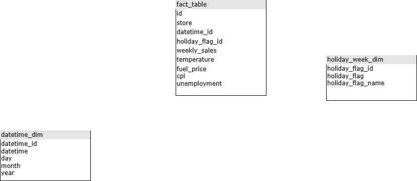

# Wal Mart ETL Project
In this project, we execute a pipeline on `WalMart` dataset you can find the data on kaggle by clicking the link:  
[WalMart dataset](https://www.kaggle.com/datasets/yasserh/walmart-dataset)

# Dataset Description:
One of the leading retail stores in the US, Walmart, would like to predict the sales and demand accurately. There are certain events and holidays which impact sales on each day. There are sales data available for 45 stores of Walmart. The business is facing a challenge due to unforeseen demands and runs out of stock some times, due to the inappropriate machine learning algorithm. An ideal ML algorithm will predict demand accurately and ingest factors like economic conditions including CPI, Unemployment Index, etc.Walmart runs several promotional markdown events throughout the year. These markdowns precede prominent holidays, the four largest of all, which are the Super Bowl, Labour Day, Thanksgiving, and Christmas. The weeks including these holidays are weighted five times higher in the evaluation than non-holiday weeks. Part of the challenge presented by this competition is modeling the effects of markdowns on these holiday weeks in the absence of complete/ideal historical data. Historical sales data for 45 Walmart stores located in different regions are available. 

# Data Pipeline:
## Extratctor:
The `Extractor` functionality is to load data from csv as a `DataFrame` and return the read `DataFrame` to pass it to the `Transformer`.

## Transformer
The `Transformer` is to build the data model shown in the image below:  

  

After building the data model the `Extractor` passes the json object that represented the tables.

## Loader
The `Loader` functionality is to load the data into `postgresql` data base.

## QueryRunner
The `QueryRunner` functionality is to excute a query on the tables that we exported to postgress then store the result on the `tbl_anlaytics` table.

The result of the query in this application used to build dashboard using looker you can find the dashboard in the link below:  
[WalMart dashboard](https://lookerstudio.google.com/s/pjbDSljm4DE)

# Get Started:

* Option 1 : Run the app locally:
To execute this application in your machien:
1. Inastall postgresql.
2. Create a databse.
3. Edit the config.yaml with your information.
4. run `pip install requierments.txt`.
5. navigate to `src/main`.
6. run `py main.py`.

* Optuion 2 : Run Docker Image:
1. Inastall postgresql.
2. Create a databse.
3. make sure you have docker in your machine.
4. run the command:  
    `docker run --rm -e DB_HOST=host.docker.internal -e DB_PORT={your-postgrsql-port} -e DB_USER={ure-postgresql-username} -e DB_PASSWORD={you-database-password} -e DB_NAME={your-database-name} alialabed161/walmart-etl:latest`

Note: Make sure you have `python` installed.

# Resources:
[Youtube](https://www.youtube.com/watch?v=WpQECq5Hx9g)  

Thanks for reading.
